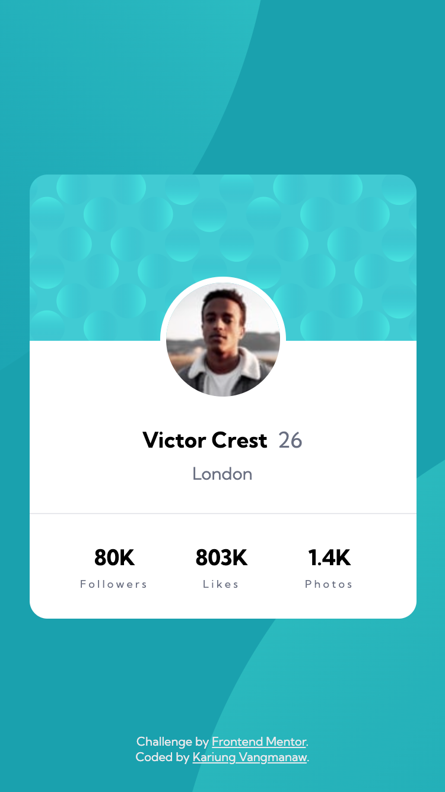
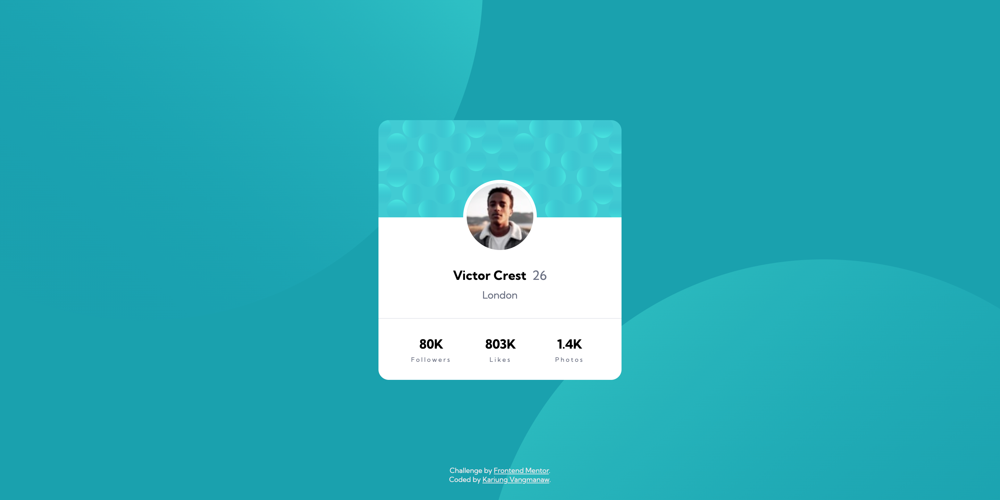

# Frontend Mentor - Profile card component solution

This is a solution to the [Profile card component challenge on Frontend Mentor](https://www.frontendmentor.io/challenges/profile-card-component-cfArpWshJ). Frontend Mentor challenges help you improve your coding skills by building realistic projects.

## Table of contents

- [Frontend Mentor - Profile card component solution](#frontend-mentor---profile-card-component-solution)
  - [Table of contents](#table-of-contents)
  - [Overview](#overview)
    - [The challenge](#the-challenge)
    - [Challenge result](#challenge-result)
    - [Screenshot](#screenshot)
    - [Links](#links)
  - [My process](#my-process)
    - [Built with](#built-with)
    - [What I learned](#what-i-learned)
    - [Continued development](#continued-development)
  - [Author](#author)
  - [Acknowledgments](#acknowledgments)

**Note: Delete this note and update the table of contents based on what sections you keep.**

## Overview

### The challenge

- Build out the project to the designs provided

### Challenge result

- 16 Sep 2025
  - ✅ Build out the project to the designs provided

### Screenshot

- Mobile view

  

- Desktop view

  

### Links

- Solution URL: [Profile Card Component using HTML and CSS](https://www.frontendmentor.io/solutions/test-K8YxS9V1Nj)
- Live Site URL: [Frontend Mentor Challenge | Profile card component](https://vangmanawkairung.github.io/frontend-mentor-profile-card-component/)

## My process

### Built with

- Semantic HTML5 markup
- CSS custom properties (variables)
- Flexbox
- CSS Grid
- Mobile-first workflow
- Responsive design with media queries
- Google Fonts (Kumbh Sans)

### What I learned

One of the key things I learned in this project was how to properly position background images in CSS. Since background placement depends on the screen size, I experimented with different values and used functions like `calc()` to fine-tune the positions. This helped me understand background positioning more deeply and made me more confident in handling responsive layouts.

### Continued development

In future projects, I would like to focus on writing cleaner and more concise CSS. I believe there are opportunities to group styles more effectively and use variables or snippets in a way that reduces repetition. Improving the structure and maintainability of my code will make it easier to scale and more professional overall. I also want to keep practicing responsive design techniques to ensure my layouts adapt smoothly across different screen sizes.

## Author

- GitHub: [Kirung Vangmanaw](https://github.com/VangmanawKairung)
- Frontend Mentor - [@VangmanawKairung](https://www.frontendmentor.io/profile/VangmanawKairunge)

## Acknowledgments

I would like to sincerely thank myself for staying persistent and continuing to push forward. A big thank you to the **Frontend Mentor team** for creating this challenge and giving me the opportunity to practice and improve my skills. I am also grateful to **OpenAI** and **Google** for developing **ChatGPT** and **Gemini**, which helped me complete this challenge and explore new techniques. A special thanks to **Figma** for providing an intuitive design tool that made translating designs into code much smoother. Lastly, I want to express my appreciation to every tool, program, and source of encouragement that supported me throughout this process. Without them, completing this challenge successfully would not have been possible.
